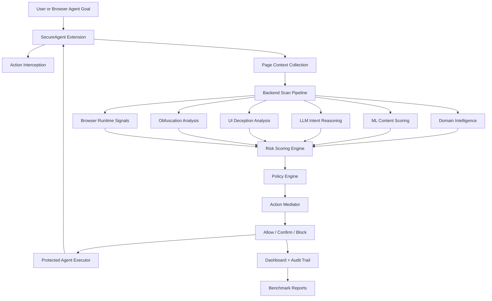

# SecureAgent Architecture Diagram

## Notes

- The protected agent executor loops through page perception, planning, scanning, mediation, execution, and replanning.
- Browser runtime inspection is preferred when Selenium/Chrome is available and falls back safely to HTTP parsing.
- Benchmark and stress outputs are exported into `benchmark-results/latest/` for demo and submission use.
